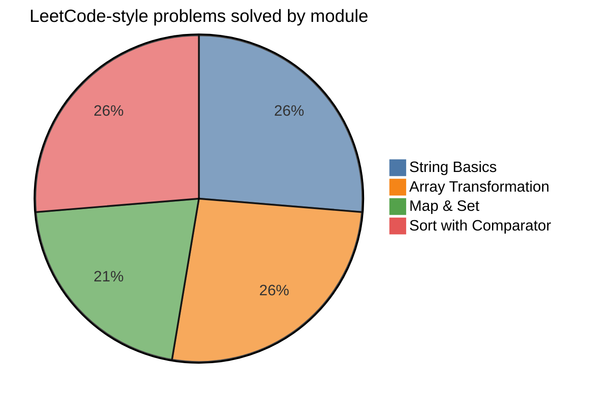

<div align="center">

# 🧪 QA SDET TypeScript Learning Lab

> Elevating QA engineers and SDETs from script-runners to systems-thinkers through core logic, patterns, and type-safe problem solving.

<br/>

[](https://www.typescriptlang.org/)
[](#)
[](#)
[](#)

<br/>

[Core Pillars](#-the-core-thesis) • [Project Structure](#-project-structure) • [Practice Modules](#-practice-modules--drills) • [Execution Guide](#-getting-started) • [Roadmap](#-learning-roadmap)

</div>

---

## 💡 The Core Thesis

> **Quality Engineering is not just about asserting expected output.**  
> It is about deconstructing runtime behavior, predicting failure modes, and writing maintainable, type-safe logic.

Modern automation frameworks and quality pipelines demand real software engineering discipline. This lab bridges the gap between basic test scripting and resilient SDET architecture:

| 🧩 Pillar | ⚙️ SDET Application | 🎯 Target Outcome |
| :--- | :--- | :--- |
| **Data Structures** | `Map`, `Set`, Queues, Stacks | Fast in-memory state tracking, payload validation, and caching |
| **Algorithmic Logic** | Two Pointers, Sliding Window | High-throughput log evaluation, stream parsing, and sequence checks |
| **Type Safety** | Generics, Narrowing, Strict Interfaces | Self-documenting API schemas and bulletproof test harnesses |
| **Edge-Case Mindset** | Falsy boundaries, off-by-one errors | Catching regressions before code reaches release candidates |

---

## 🗂️ Project Structure

```bash
src/
├── 01_TypescriptFluencyAndStringBasics/
│   ├── 01_string-basics/
│   │   └── splitAndJoins.ts
│   ├── 02_array-transformation/
│   │   └── map-filter-reduce.ts
│   ├── 03_Map&Set/
│   │   └── MapAndSet.ts
│   ├── 04_SortWithComparotor/
│   │   └── SortWithComparator.ts
│   └── README.md
├── Practice/
│   ├── mapPractice.ts
│   ├── map-filter-reducePractice.ts
│   ├── setPractice.ts
│   └── stackPractice.ts
├── index.ts
└── README.md
```

### Module Breakdown

- `01_TypescriptFluencyAndStringBasics/01_string-basics` &rarr; String parsing, tokenization, sanitization, and boundary conditions.
- `01_TypescriptFluencyAndStringBasics/02_array-transformation` &rarr; Declarative data pipelines using `map()`, `filter()`, and `reduce()`.
- `01_TypescriptFluencyAndStringBasics/03_Map&Set` &rarr; Hash-based indexing, frequency mapping, and unique value tracking.
- `01_TypescriptFluencyAndStringBasics/04_SortWithComparotor` &rarr; Sorting with custom comparator logic and relative ordering problems.
- `Practice/` &rarr; Mini-drills, experimental coding, and scratchpad exercises.

---

## 🎯 Practice Modules & Drills

Click each section to inspect problem sets:

<details open>
<summary><b>1. String Fundamentals & Sanitization</b> (5/5 Complete)</summary>
<br/>

- [x] **Reverse Words in a String** — Word-level boundary preservation and token iteration
- [x] **Defang an IP Address** — Safe string substitution and sanitization routines
- [x] **Truncate Sentence** — Prefix boundary slicing without trailing whitespace
- [x] **Valid Anagram** — Frequency mapping comparison vs. alphabetical sorting
- [x] **Simplify Unix Path** — Canonical folder resolution using stack-like transitions

</details>

<details open>
<summary><b>2. Declarative Array Transformations</b> (5/5 Complete)</summary>
<br/>

- [x] **Running Sum of 1D Array** — Prefix accumulation patterns
- [x] **Filter Active Usernames** — Predicate-based data filtering and truthy assertions
- [x] **Frequency Counter** — Streaming single-pass key/value aggregation via `reduce()`
- [x] **Cart Total with Discount Logic** — Object streaming, floating-point rounding, and business rules
- [x] **Group Items by Category** — Dynamic bucket aggregation and structural transforms

</details>

<details open>
<summary><b>3. Map & Set Optimization</b> (4/5 Complete)</summary>
<br/>

- [x] **Two Sum** — Complement lookups in $\mathcal{O}(n)$ time using Hash Maps
- [x] **Contains Duplicate** — $\mathcal{O}(1)$ uniqueness validation with Sets
- [x] **Intersection of Two Arrays** — Multi-collection filtering and set membership checks
- [x] **First Non-Repeating Character** — Frequency map coupled with chronological scanning
- [ ] **Group Anagrams** — Deterministic key hashing and bucket mapping

</details>

<details open>
<summary><b>4. Sort with Comparator</b> (5/5 Complete)</summary>
<br/>

- [x] **Sort Colors** — Three-way partition logic for counting-based sorting
- [x] **Largest Number** — Comparator-driven concatenation ordering
- [x] **Sort Characters by Frequency** — Count map plus frequency-based ordering
- [x] **Custom Multi-Level Object Sorting** — Department / salary / name ranking rules
- [x] **Relative Sort Array** — Order by pattern array while leaving leftovers sorted

</details>

---

## ⚡ Getting Started

### Prerequisites

Ensure you have [Node.js](https://nodejs.org/) (v18+) and [npm](https://www.npmjs.com/) installed.

```bash
# Clone the repository
git clone https://github.com/your-username/qa-sdet-ts-lab.git

# Navigate into the lab root
cd qa-sdet-ts-lab

# Install dependencies
npm install
```

### Running Practice Files

Run any drill directly using `tsx` (TypeScript Execute) without a manual build step:

```bash
# Run a specific String drill
npx tsx src/01_TypescriptFluencyAndStringBasics/01_string-basics/splitAndJoins.ts

# Run an Array Transformation drill
npx tsx src/01_TypescriptFluencyAndStringBasics/02_array-transformation/map-filter-reduce.ts

# Run a Map & Set drill
npx tsx src/01_TypescriptFluencyAndStringBasics/03_Map&Set/MapAndSet.ts

# Run a Sort with Comparator drill
npx tsx src/01_TypescriptFluencyAndStringBasics/04_SortWithComparotor/SortWithComparator.ts
```

### Project-Wide Commands

```bash
# Run the main entry point
npm run start

# Run strict TypeScript type verification
npm run typecheck
```

### LeetCode-style progress

This repo currently contains 20 interview-style coding problems across the main learning modules, with 19 solved and 1 still pending.

| Module | Problems | Solved |
| --- | ---: | ---: |
| String Basics | 5 | 5 |
| Array Transformation | 5 | 5 |
| Map & Set | 5 | 4 |
| Sort with Comparator | 5 | 5 |
| Total | 20 | 19 |



> Current open item: Group Anagrams in the Map & Set section.

---

## 🗺️ Learning Roadmap

Track your progress across the complete SDET technical curriculum:

```
[Phase 1: Foundations] ──► [Phase 2: Core Patterns] ──► [Phase 3: Systems & Data]
       (Complete)                 (In Progress)                 (Planned)
```

- [x] **Phase 1: Foundations**
  - [x] String manipulation & regex fundamentals
  - [x] Declarative transformations (`map`, `filter`, `reduce`)
  - [x] Key-value pairs (`Map`) and unique sets (`Set`)
- [ ] **Phase 2: Core Algorithmic Patterns**
  - [ ] Two-pointer navigation
  - [ ] Sliding window arrays and substring optimization
  - [ ] Monotonic stacks & recursion queues
  - [ ] 60-minute timed mock coding drills
- [ ] **Phase 3: Real-World SDET Scenarios**
  - [ ] Asynchronous event loop & race conditions handling
  - [ ] Dynamic JSON schema diffing and payload assertions
  - [ ] Relational SQL aggregation & data reasoning
  - [ ] Live verbal problem-solving & narration walkthroughs

---

<div align="center">

**Built for technical rigor, analytical reasoning, and software reliability.**  
*Crafted for continuous learning and engineering growth.*

</div>
